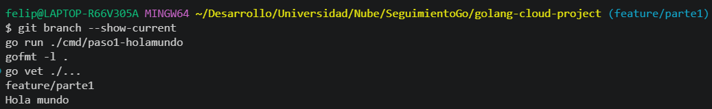
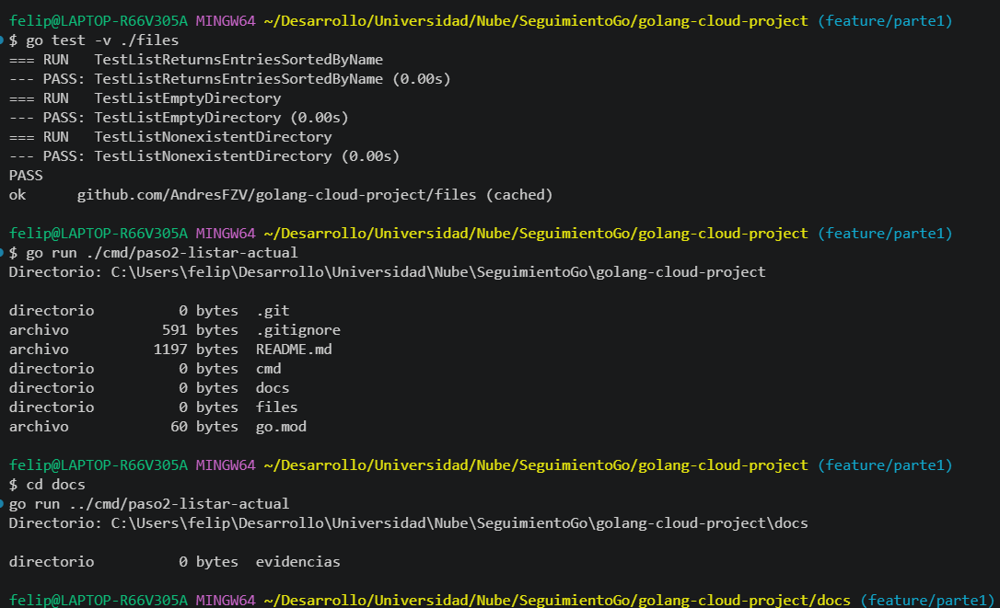

# golang-cloud-project

Desarrollo de una aplicación en Go para la gestión de imágenes, codificación Base64 y visualización mediante un servidor HTTP. Proyecto académico de Computación en la Nube.

## Requisitos

- Go 1.25.1 o superior
- Git

## Estructura del proyecto

```
.
├── go.mod
├── cmd/                       # Un ejecutable por paso
│   ├── paso1-holamundo/
│   └── paso2-listar-actual/
├── files/                     # Paquete reutilizable: lectura de directorios
└── docs/
    └── evidencias/            # Capturas de ejecución por paso
```

## Verificación de calidad

Desde la raíz del repositorio:

```bash
gofmt -l .     # No debe listar archivos
go vet ./...   # No debe reportar advertencias
```

## Parte 1

### Paso 1: Hola mundo

Aplicación que imprime "Hola mundo" en la salida estándar.

Ejecución:

```bash
go run ./cmd/paso1-holamundo
```

Resultado:

```
Hola mundo
```

Evidencia:



## Parte 2

### Paso 2: Listar archivos del directorio actual

Aplicación que lista las entradas del directorio de trabajo actual (desde donde se ejecuta el programa), mostrando tipo, tamaño y nombre. La lectura del directorio está en el paquete `files`, que no imprime nada y puede reutilizarse en la Parte 2.

Ejecución:

```bash
go run ./cmd/paso2-listar-actual
```

Resultado (ejecutado desde la raíz del repositorio):

```
Directorio: C:\Users\felip\Desarrollo\Universidad\Nube\SeguimientoGo\golang-cloud-project

directorio          0 bytes  .git
archivo           591 bytes  .gitignore
archivo          1197 bytes  README.md
directorio          0 bytes  cmd
directorio          0 bytes  docs
directorio          0 bytes  files
archivo            60 bytes  go.mod
```

Pruebas unitarias:

```bash
go test -v ./files
```

Evidencia:


## Recursos externos

- https://go.dev/doc/tutorial/getting-started
- https://pkg.go.dev/fmt
- https://go.dev/doc/effective_go
- https://go.dev/doc/modules/layout
- https://www.conventionalcommits.org/es/v1.0.0/