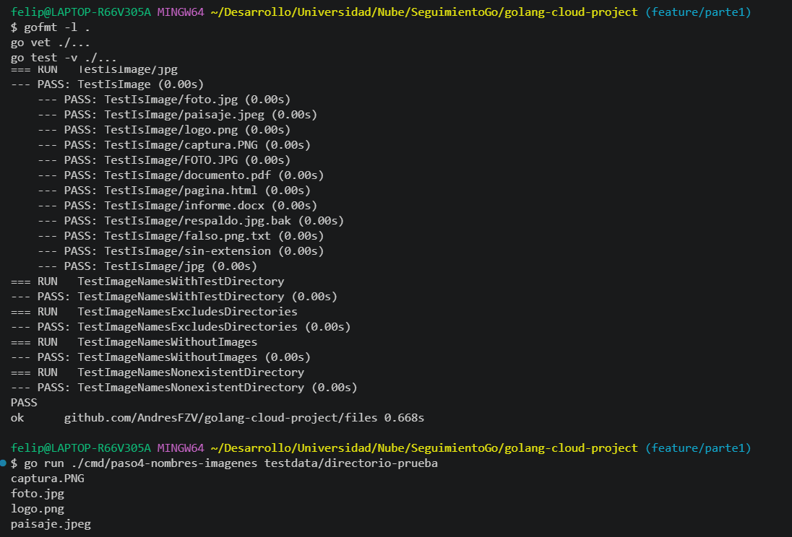

# golang-cloud-project

Desarrollo de una aplicación en Go para la gestión de imágenes, codificación Base64 y visualización mediante un servidor HTTP. Proyecto académico de Computación en la Nube.

## Requisitos

- Go 1.25.1 o superior
- Git

## Estructura del proyecto

```
.
├── go.mod
├── cmd/                       # Un ejecutable por paso
│   ├── paso1-holamundo/
│   ├── paso2-listar-actual/
│   ├── paso3-listar-directorio/
│   └── paso4-nombres-imagenes/
├── files/                     # Paquete reutilizable: lectura de directorios y filtrado de imágenes
├── testdata/
│   └── directorio-prueba/     # Archivos de distintos formatos para pruebas
└── docs/
    └── evidencias/            # Capturas de ejecución por paso
```

## Verificación de calidad

Desde la raíz del repositorio:

```bash
gofmt -l .     # No debe listar archivos
go vet ./...   # No debe reportar advertencias
```

## Parte 1

### Paso 1: Hola mundo

Aplicación que imprime "Hola mundo" en la salida estándar.

Ejecución:

```bash
go run ./cmd/paso1-holamundo
```

Resultado:

```
Hola mundo
```

Evidencia:


## Parte 2

### Paso 2: Listar archivos del directorio actual

Aplicación que lista las entradas del directorio de trabajo actual (desde donde se ejecuta el programa), mostrando tipo, tamaño y nombre. La lectura del directorio está en el paquete `files`, que no imprime nada y puede reutilizarse en la Parte 2.

Ejecución:

```bash
go run ./cmd/paso2-listar-actual
```

Resultado (ejecutado desde la raíz del repositorio):

```
Directorio: C:\Users\felip\Desarrollo\Universidad\Nube\SeguimientoGo\golang-cloud-project

directorio          0 bytes  .git
archivo           591 bytes  .gitignore
archivo          1197 bytes  README.md
directorio          0 bytes  cmd
directorio          0 bytes  docs
directorio          0 bytes  files
archivo            60 bytes  go.mod
```

### Paso 3: Listar archivos de un directorio especificado

Aplicación que recibe la ruta de un directorio como argumento y lista sus entradas mostrando tipo, tamaño y nombre. Valida que se reciba exactamente un argumento y reporta un error si el directorio no existe.

Ejecución:

```bash
go run ./cmd/paso3-listar-directorio <directorio>
```

Resultado con el directorio de prueba:

```bash
go run ./cmd/paso3-listar-directorio testdata/directorio-prueba
```

```
archivo        446644 bytes  captura.PNG
archivo             0 bytes  datos.csv
archivo             0 bytes  documento.pdf
archivo             0 bytes  falso.png.txt
archivo       1546453 bytes  foto.jpg
archivo             0 bytes  informe.docx
archivo        956885 bytes  logo.png
archivo             0 bytes  notas.txt
archivo             0 bytes  pagina.html
archivo         22979 bytes  paisaje.jpeg
archivo             0 bytes  respaldo.jpg.bak
archivo             0 bytes  sin-extension
directorio          0 bytes  subcarpeta
```

Sin argumento (código de salida 2):

```
error: se esperaba 1 argumento, se recibieron 0
uso: paso3-listar-directorio <directorio>
```

Directorio inexistente (código de salida 1):

```
error: leer directorio: open ...\no-existe: The system cannot find the file specified.
```

#### Directorio de prueba

`testdata/directorio-prueba/` contiene 12 archivos y un subdirectorio:

- Imágenes: `foto.jpg`, `paisaje.jpeg`, `logo.png`, `captura.PNG` (extensión en mayúsculas).
- Otros formatos: `documento.pdf`, `pagina.html`, `informe.docx`, `notas.txt`, `datos.csv`.
- Casos límite: `respaldo.jpg.bak` y `falso.png.txt` (contienen una extensión de imagen que no es la real), `sin-extension` y `subcarpeta/` (directorio con una imagen dentro, que no debe listarse).

### Paso 4: Mostrar solo los nombres de las imágenes

Aplicación que muestra únicamente los nombres de los archivos de imagen (`.jpg`, `.jpeg`, `.png`) del directorio indicado, uno por línea. La identificación no distingue mayúsculas (`captura.PNG` se reconoce) y usa la extensión real del archivo (`respaldo.jpg.bak` no se reconoce). Los subdirectorios se excluyen.

Ejecución:

```bash
go run ./cmd/paso4-nombres-imagenes <directorio>
```

Resultado con el directorio de prueba (4 imágenes de 12 archivos):

```
captura.PNG
foto.jpg
logo.png
paisaje.jpeg
```

Sin argumento (código de salida 2):

```
error: se esperaba 1 argumento, se recibieron 0
uso: paso4-nombres-imagenes <directorio>
```

Directorio inexistente (código de salida 1):

```
error: leer directorio: open no-existe: The system cannot find the file specified.
```

Directorio sin imágenes (`docs`): no imprime nada y termina con código 0.

Pruebas unitarias:

```bash
go test -v ./files
```

Evidencia:



### Paquete `files` (reutilizable)

| Función | Descripción |
|---|---|
| `List(dir string) ([]fs.FileInfo, error)` | Entradas del directorio ordenadas por nombre |
| `IsImage(name string) bool` | Indica si el nombre tiene extensión `.jpg`, `.jpeg` o `.png` |
| `ImageNames(dir string) ([]string, error)` | Nombres de las imágenes del directorio, sin subdirectorios |

Las funciones no imprimen nada; devuelven datos y errores.

Pruebas unitarias:

```bash
go test -v ./...
```

Evidencia:


Pruebas unitarias:

```bash
go test -v ./files
```

Evidencia:


## Recursos externos

- https://go.dev/doc/tutorial/getting-started
- https://pkg.go.dev/fmt
- https://go.dev/doc/effective_go
- https://go.dev/doc/modules/layout
- https://www.conventionalcommits.org/es/v1.0.0/
- https://pkg.go.dev/os#Args
- https://pkg.go.dev/path/filepath#Abs
- https://go.dev/wiki/TableDrivenTests
- https://pkg.go.dev/path/filepath#Ext
- https://pkg.go.dev/strings#ToLower